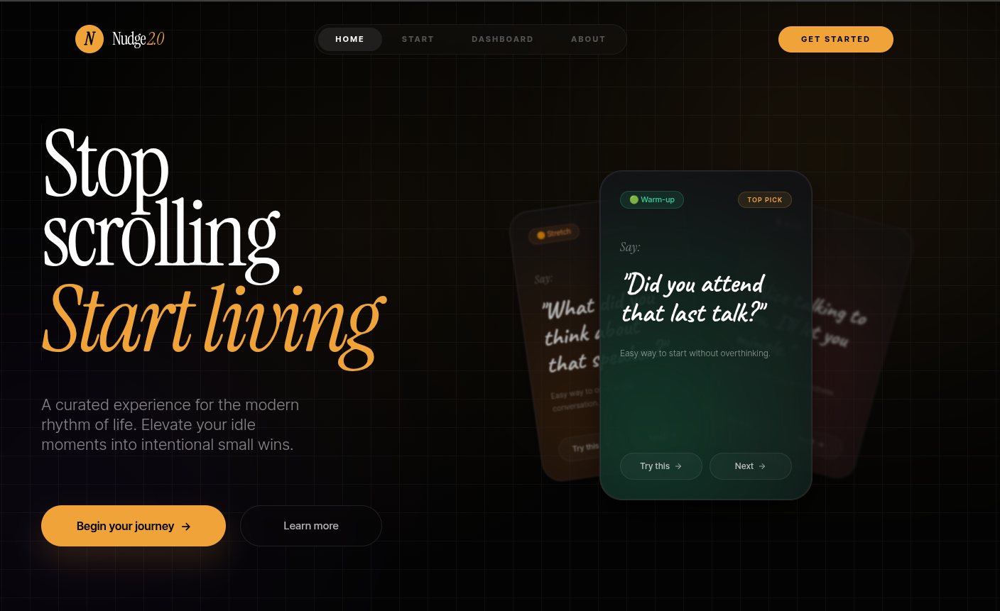
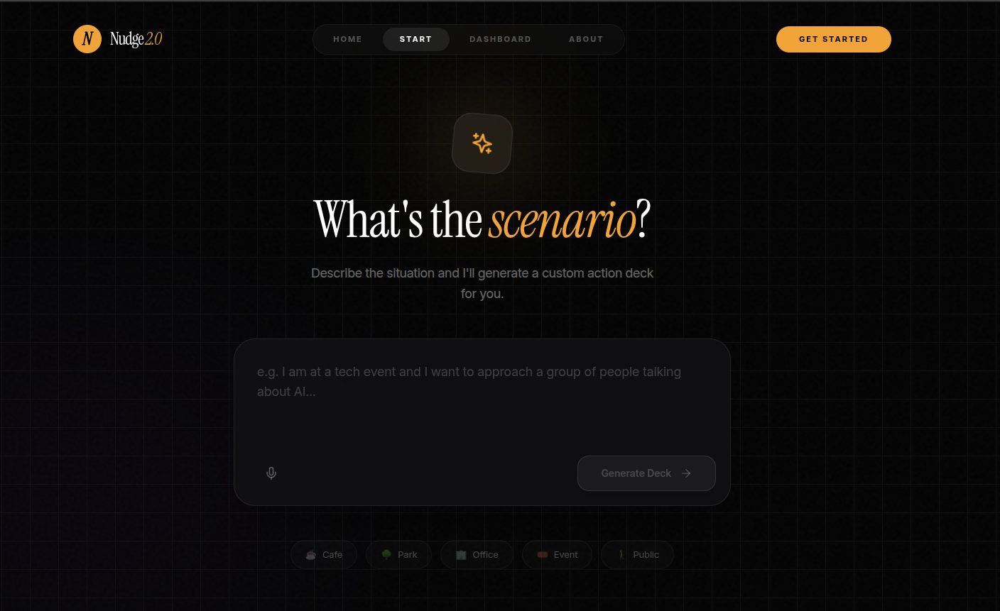
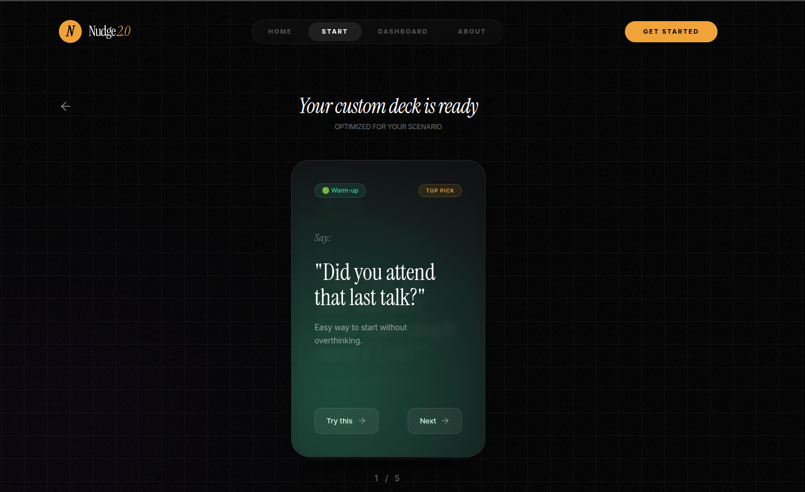
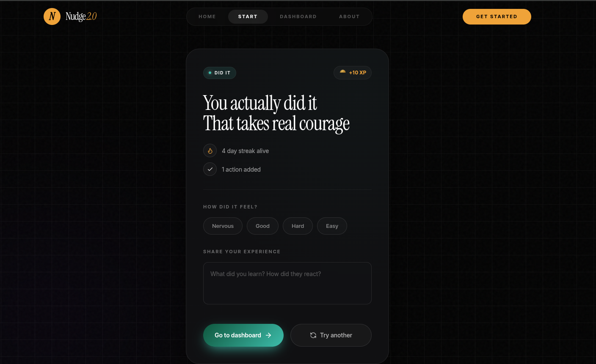
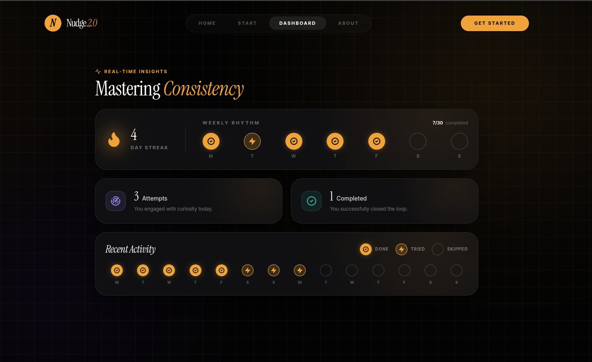

# <p align="center"></p>

<p align="center">
  
  
  
  
</p>

---

# Nudge 2.0
> **Stop Scrolling, Start Living.** A premium behavioral design experiment turned into a habit-tracking experience.

Nudge isn't just another habit tracker. It’s a tool designed to build positive behavioral momentum through thoughtful interactions, psychological rewards, and a premium, distraction-free UI.

## 🧠 The Philosophy
Most habit trackers feel punitive—a list of chores you failed to complete. Nudge was built on the principle of **intentional small wins**. By focusing on the "nudge" rather than the "grind," we explore how elegant design can lower the barrier to positive action.

---

## ✨ Key Features
- **🎯 Scenario-Based Action:** Describe your current situation, and Nudge generates a custom action deck tailored to your context.
- **🎴 Tactile Card Experience:** Swipeable, high-fidelity cards that make choosing your next action feel like a premium ritual.
- **📈 Consistency Dashboard:** A sleek, minimal dashboard that focuses on momentum and "Weekly Rhythm" rather than just raw numbers.
- **🔐 Seamless Auth:** A beautiful, secure login experience powered by Supabase.

---

## 📸 Experience the Journey

### 01. The Hero Experience
The landing page sets the tone—minimalist, bold, and focused on the transition from passive consumption to active living.
<p align="center">
  
</p>

### 02. Defining the Scenario
Nudge uses AI-driven scenarios to provide context-aware suggestions. Whether you're at a tech event or a park, the app adapts to you.
<p align="center">
  
</p>

### 03. The Action Deck
Custom-generated cards provide clear, actionable "nudges" to help you break out of your routine.
<p align="center">
  
  
</p>
<p align="center"><i>From discovery to decision—every interaction is designed to be frictionless.</i></p>

### 04. Mastering Consistency
The dashboard provides a "Real-Time Insight" into your behavioral patterns, celebrating streaks and completed loops.
<p align="center">
  
</p>
<p align="center"><b>Nudge dashboard experience</b></p>

---

## 🛠️ Tech Stack
- **Core:** [React](https://reactjs.org/) + [Vite](https://vitejs.dev/)
- **Type Safety:** [TypeScript](https://www.typescriptlang.org/)
- **Animation:** [Framer Motion](https://www.framer.com/motion/)
- **Styling:** [Tailwind CSS](https://tailwindcss.com/)
- **Backend:** [Supabase](https://supabase.com/) (Auth & Database)

---

## 🚀 Getting Started

1. **Clone & Install**
   ```bash
   git clone <your-repository-url>
   cd Nudgev6
   npm install
   ```

2. **Environment Configuration**
   Create a `.env` file in the root:
   ```env
   VITE_SUPABASE_URL=your_project_url
   VITE_SUPABASE_ANON_KEY=your_anon_key
   ```

3. **Launch**
   ```bash
   npm run dev
   ```

---

## 🎨 Design Notes
As a product designer, Nudge is my exploration of the intersection between **Premium Aesthetics** and **Functional Engineering**. Every grid line, serif font choice (Cormorant Garamond), and micro-interaction is intentional—aimed at creating a sense of calm and focus.

---

<p align="center">
  Built with ❤️ by [Your Name]
</p>
